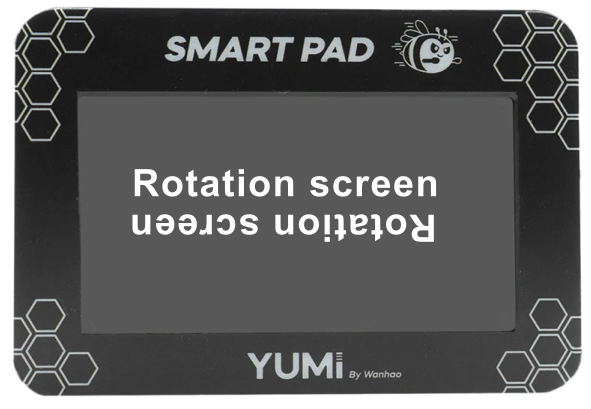

# Smartpad Screen Rotation



This repository contains the **rotate_screen.sh** script designed to rotate the screen of the Smartpad Yumi when it is connected to an external display via HDMI.

## Prerequisites

- Ensure you have the necessary permissions to execute scripts on your device.
- Make sure the Smartpad Yumi is connected to an external display and properly configured.
- SSH access to your Smartpad Yumi

## Steps

## Connect Smartpad Yumi to External Display

1. Power on your Smartpad Yumi.
2. Connect the Smartpad Yumi to the external display using an HDMI cable.
3. Ensure the external display is turned on and set to the correct HDMI input.

## Connect to Smartpad Yumi via SSH

1. Obtain the IP address of your Smartpad Yumi.
2. Open a terminal on your local machine and connect to the Smartpad Yumi via SSH:

   ```bash
   ssh pi@smartpad_ip_address
   ```

   Replace `smartpad_ip_address` with the actual IP address of your Smartpad Yumi.

   

## Installation

To download and execute the `rotate_screen.sh` script from this GitHub repository, follow these steps:

### Clone the Repository

First, clone the repository to your local machine using the following command:

```bash
git clone https://github.com/adnroboticsfr/smartpad_screen_rotation.git
```

### Navigate to the Directory

Change your working directory to the cloned repository:

```bash
cd smartpad_screen_rotation
```

### Make the Script Executable

Before executing the script, ensure it has the necessary execute permissions:

```bash
chmod +x rotate_screen.sh
```

### Execute the Script

Run the script to rotate the Smartpad Yumi screen:

```bash
sudo ./rotate_screen.sh
```

## Usage

The `rotate_screen.sh` script can be customized to rotate the screen.


